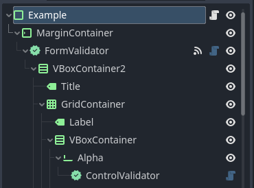
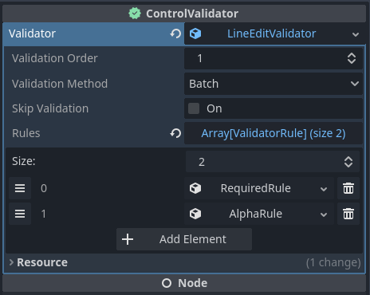

# godot-form-validator

 

A Godot 4 plugin for adding validation logic to any control.

An [example scene](addons/godot-form-validator/example/example.tscn) is provided.



## FormValidator

The ```FormValidator``` control should sit as a parent (direct or indirect) to the controls you wish to validate. 

### Signals
* ```control_validated``` - Emitted when a control has been validated either through auto validation or after calling ```FormValidator.validate()```.
   * ```control``` - The control that was validated.
   * ```passed``` - True if the control passed validation; otherwise, false.
   * ```messages``` - A ```PackedStringArray``` of failed validation messages, if any.

### Properties

* Auto Validate - If true then controls will trigger validation logic when they lose focus (or their value is changed in the case of ```Range``` controls or controls that provide a ```value_changed``` signal.). Otherwise, validation must be invoked manually via ```FormValidator.validate()```.
* Validation Method - Determines how validation logic is processed for each ```ControlValidator``` and the ```FormValidator``` as a whole.
    * Batch - Processes all validators and rules before returning a result.
    * Fail Fast - Processes validators until a rule failure is encountered, then proceeds to the next validator.
    * Immediate - Processes validators until a rule failure is encountered and returns immediately.


## ControlValidator

The ```ControlValidator``` node should sit as a child to the control node you wish to validate.

### Properties

* Validator - The ```Validator``` that is invoked to process validation logic for it's parent control. This will be automatically assigned if a compatible validator is registered with the ```Validation``` class. Otherwise a default ```Validator``` instance will be assigned, but can be replaced with a more specific or custom one as you see fit.

Refer to ```ButtonValidator```, ```LineEditValidator```, ```RangeValidator``` and ```TextEditValidator``` for examples.

See ```Validation.add_validator()``` to add custom validators.


## Validator

The ```Validator``` determines how validation logic is processed for a given control.

### Properties
* Validation Order - Determines the order in which this validator is processed relative to others. Most useful for the Immediate validation method as this will determine which control fails first.
* Validation Method - Matches the value of ```FormValidator.validation_method``` by default, but can be overridden for control-specific needs.
* Skip Validation - If true validation for this control will be skipped.
* Rules - The validation rules applied to the control. See ```Rule```.


## Rule

Rules provide the actual validation logic by comparing the validating control's current value to the expected result. Several rules are provided by default and custom rules can be implemented via the ```CustomRule``` expression or by extending the ```ValidatorRule``` class.



### Provided Rules

* Alphanumeric - Text must be alphanumeric (having letters and numbers only).
* Alpha - Text must contain letters only.
* Boolean - The control value must equal the specified boolean value. Useful for buttons or checkboxes.
* Custom - The custom expression is evaluated and must return true for passing, or false. Two arguments are passed:
    * ```control``` - The control being validated.
    * ```value``` - The control value being validated.
* Does Not Match - Text must not match the specified regular expression.
* Email - Text must be a valid email address.
* Equals - The control value must equal the specified value.
* Greater Than - The control value must be greater than the specified value.
* Length - Text must have a string length between the specified minimum and maximum.
* Less Than - The control value must be less than the specified value.
* Matches - Text must match the specified regular expression.
* Not Blank - The control value must not be blank (not empty and not only whitespace).
* Not Empty - The control value must not be empty (has a string length greater than 0, whitespace included).
* Numeric - Text must contain numbers only.
* Required - The control value is required. Same as Not Blank, with a different validation message.
